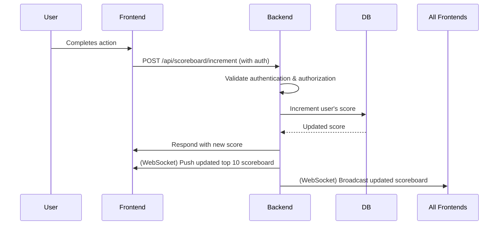

# Scoreboard API Module Specification

## Overview

This module provides backend API endpoints and real-time capabilities to support a live-updating scoreboard for a website. The scoreboard displays the top 10 users by score, and updates in real time as users perform actions that increase their scores.

---

## Functional Requirements

1. **Scoreboard Display**

   - Endpoint to fetch the top 10 users and their scores.
   - Scores are sorted in descending order.

2. **Score Update**

   - Endpoint to increment a user's score when they complete an action.
   - Only authenticated and authorized users can update their own scores.

3. **Live Updates**

   - Real-time push mechanism (e.g., WebSockets) to broadcast scoreboard changes to all connected clients.

4. **Security**
   - Prevent unauthorized score updates.
   - Ensure users can only increment their own scores.

---

## API Endpoints

### 1. `GET /api/scoreboard/top`

- **Description:** Returns the top 10 users and their scores.
- **Response:**
  ```json
  [
    { "userId": "string", "username": "string", "score": number },
    ...
  ]
  ```

### 2. `POST /api/scoreboard/increment`

- **Description:** Increments the authenticated user's score by 1 (or configurable value).
- **Request Body:** _Empty_ (user is identified via authentication token)
- **Authentication:** Required (JWT or session)
- **Response:**
  ```json
  { "success": true, "newScore": number }
  ```

### 3. **WebSocket/Server-Sent Events**

- **Description:** Clients subscribe to real-time scoreboard updates.
- **Event:** `scoreboardUpdate`
- **Payload:** Same as `GET /api/scoreboard/top` response.

---

## Flow of Execution



---

## Security Considerations

- **Authentication:** All score update requests must be authenticated (e.g., JWT, OAuth2, session).
- **Authorization:** Users can only increment their own scores.
- **Rate Limiting:** Prevent abuse by limiting how often a user can increment their score.
- **Input Validation:** Ensure no direct score manipulation (e.g., no arbitrary score values in requests).

---

## Comments & Suggestions for Improvement

- **Audit Logging:** Log all score changes for monitoring and rollback in case of abuse.
- **Leaderboard Pagination:** Consider supporting pagination for larger leaderboards.
- **Score Decay:** Optionally, implement score decay or time-based leaderboards.
- **Testing:** Include unit and integration tests for all endpoints and real-time features.
- **Monitoring:** Add metrics for API usage, error rates, and suspicious activity.
- **Extensibility:** Design the module to allow for future features (e.g., badges, achievements).

---

## Example Technologies

- **Backend:** Node.js (Express, Fastify), Python (FastAPI), Go, etc.
- **Database:** PostgreSQL, MongoDB, Redis (for fast leaderboard queries).
- **Real-time:** WebSockets (Socket.IO, ws), Server-Sent Events.
- **Authentication:** JWT, OAuth2, session-based.
